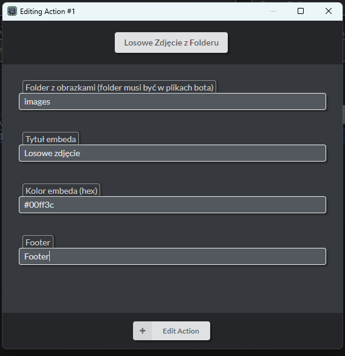

# Mod na losowe zdjęcie z danego folderu – DBM MOD (v14)

Akcja dla **Discord Bot Maker v14 MOD**, która umożliwia losowe wysyłanie obrazka z folderu znajdującego się w głównym katalogu bota. Można ustawić tytuł, kolor oraz footer embeda.

---

## 🖼️ Podgląd akcji

---

## ⚙️ Wymagane mody

1. Mod od shadowa do pobrania na https://dbm-polska.github.io/DBM-14/tutorial/
2. Discord.js v14
3. Node.JS v22

---

## 📥 Instalacja

1. Pobierz plik `img_random_MOD.js` do folderu `actions` w DBM.
2. W głównym katalogu bota utwórz folder z obrazkami (np. `images`).
3. W DBM dodaj nową akcję i wybierz **Losowe Zdjęcie z Folderu**.
4. Dodaj do folderu `images` jakieś zdjęcia.
5. Gotowe!

---

## ✅ Obsługiwane rozszerzenia obrazów

- `.jpg`
- `.jpeg`
- `.png`
- `.gif`
- `.webp`

---

## ℹ️ Informacje

- **Mod został tworzony przy pomocy chatgpt**

